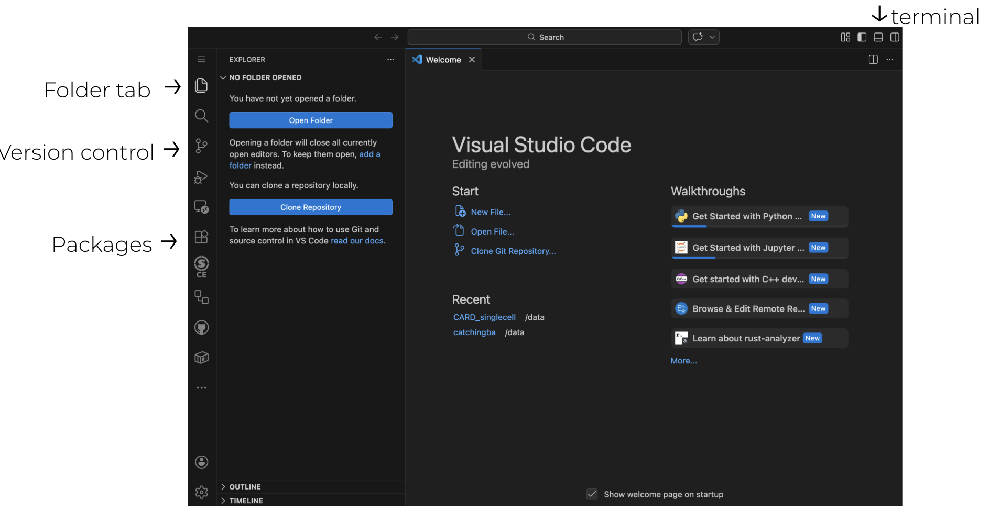

# VSCode

All that is required for coding is a text editor and some form of a compiler/kernel to run the code. Back in the day, most folks used VIM/EMACS (VIM being superior) to edit their code and compiled/ran that code in terminal. This creates a lot of moving parts, and why most people use Integrated Development Environments (IDEs). VSCode is one of the most up to date IDEs available on Biowulf, and includes a great amount of optionality including:

- Library of extensions for visualization, compiling, interactivity, etc.
- Create and open a vast number of file types, with on-the-fly syntax linting
- Folder navigator, terminal, GitHub tracking built in
- Access to a HPC resources (on Biowulf)

## Navigating VSCode

When you load VSCode, either from Biowulf or on your device, you are welcomed by:

Go through the list of getting started actions, in part to familiarize yourself with VSCode. I usually use the dark theme reducing eye strain. 

## VSCode extensions 

With VSCode you can add extensions that increase the usability and functionality than that of a normal IDE. By clicking on the group of 4 squares on the left hand side of the IDE pulls up possible extensions to install.

By typing into the search bar on top you can find different packages to install. The extensions needed for this workshop include:

- Python
- Python Debugger
- R (optional)
- Jupyter
- Github actions
- Snakemake language
- Apptainer/Singularity

Once the 

## Creating a new file

## Working with GitHub